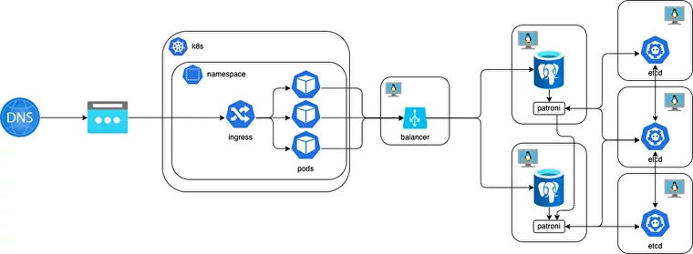

# Weather app deployment

This repo contains an Ansible playbook for deploying Postresql cluster DB with etcd and haproxy as load balancer.
The app is distributed in a Docker container and can be deployed via Helm chart. Simple API in the app returns weather information from the database.

## Infrastructure schema

## Steps to deploy

1. Clone repo and `cd` into it.
2. Place the `kubeconfig` file in the master with `student*` name pattern.
3. Add SSH public keys to hosts.
4. Setup Ansible inventory:
   1. Fill  **internal** IPs for etcd_cluster \ balancers (which will haproxy) \ master \ replica in inventory file
   2. Change `ansible_ssh_private_key_file=` to your private SSH key path for hosts.
6. Setup credentials for the DB connection in `./vars/main.yml` - `admin` as an example.
7. Run playbook - `ansible-playbook deploy_pgcluster.yml`
8. After successful Ansible Playbook execution, you will see a public IP for Haproxy.
9.  Setup Helm values in `./app/values.yalm`:
   1. Change  `PGID`, `PGPASS` from step 5 to yours and `PGIP` to Haproxy IP from step 7.
   2. Change `DOTNET_ENVIRONMENT` to `Development` if you want see Swagger page on the `$IP/swagger/index.html`
11. Deploy Helm chart in K8S: `helm --kubeconfig ./student*.yaml install app /app`
12. Run  `./app/test-api.sh` to see an example API response from DB.

## Credits

 - [Original Ansible Playbook](https://github.com/vitabaks/postgresql_cluster)
 - [API](https://ghcr.io/ldest/sre-course/api)
